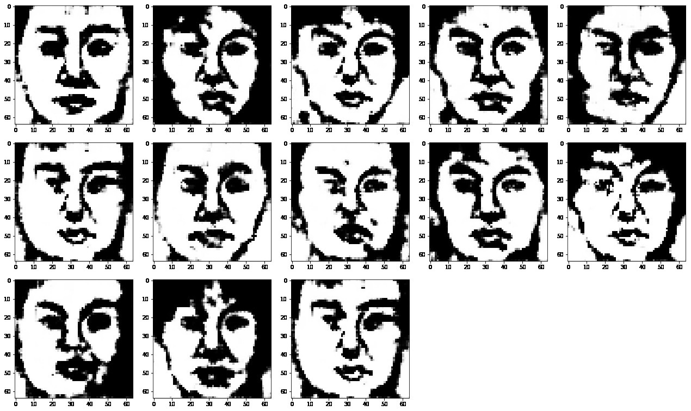
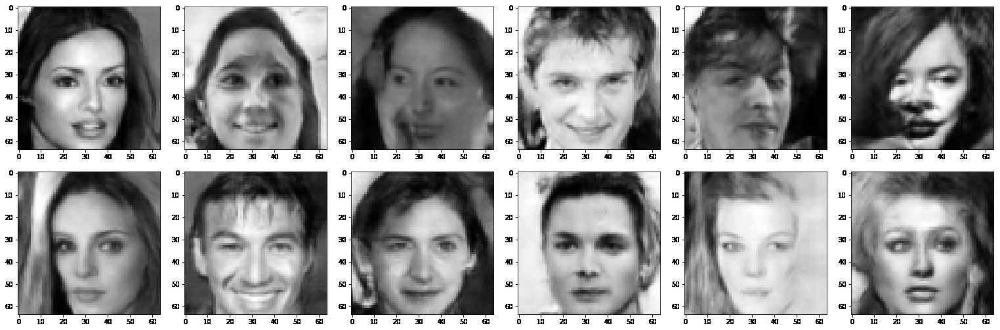
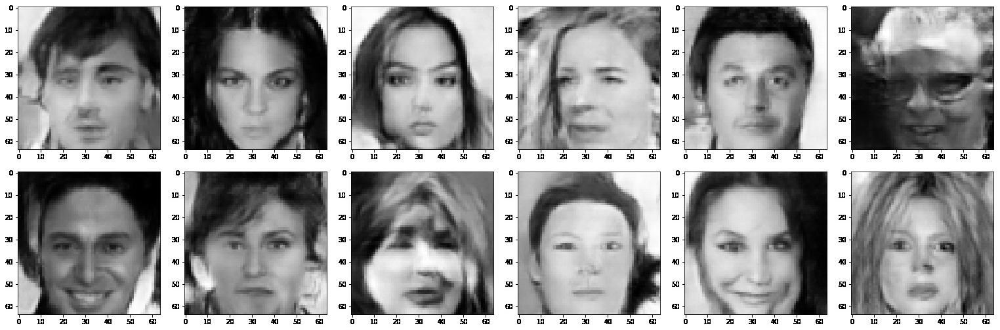

## Introduction
The goal of this project is to explore Generative Adversarial Networks to generate images of faces.

* DCGAN implemented for CUFS and CelebA datasets

* LSGAN on CelebA datasets

Refer the handout and report for more details.

Also checkout the results of Variational autoencoders applied to the same task [here](https://github.com/prakveer/Celebrity_generation_VAE) 

## Results
`Generated Images for CUFS dataset (DCGAN)`

 

`Generated Images for CelebA dataset (DCGAN) `

 

`Generated Images for CelebA dataset (LSGAN) `

 

